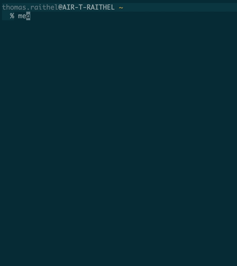

# AOE meals commandline tool

A simple commandline tool to display meals of the current or next week in your terminal.



# Requirements

This tool is written in OCaml. On top of Ocaml standard-tools, following packages
are required:


```
$ brew install gmp
$ opam install lambdasoup cohttp lwt js_of_ocaml tls
```

# Build

To build build the program, just use the `Makefile`

```
$ make
$ make test
```

Make the native binary available in `$PATH`

```
$ cp main.native ~/bin/meals
$ meals
```
